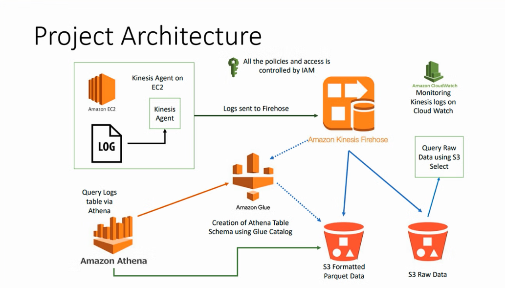
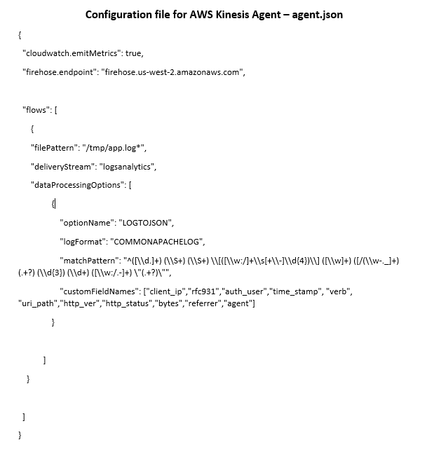

# Log Analytics Using AWS

This project demonstrates an end-to-end log analytics solution using AWS services. The architecture enables the collection, ingestion, processing, and querying of log data from various sources in near real-time. The system is scalable, reliable, and cost-effective, leveraging key AWS services for seamless integration and automation.

## Table of Contents
- [Overview](#overview)
- [Architecture](#architecture)
- [AWS Services Used](#aws-services-used)
- [Setup Instructions](#setup-instructions)
- [Project Execution](#project-execution)
- [Key Features](#key-features)
- [Future Improvements](#future-improvements)
- [Conclusion](#conclusion)

## Overview
Log analytics is essential for monitoring application availability, detecting fraud, and ensuring SLA compliance. This solution addresses the need to analyze log data from various sources, transforming it into a common format for easy querying and insights generation.

The project uses AWS native services to build a highly scalable and automated log analytics pipeline that processes both batch and streaming data.

## Architecture

## AWS Services Used
- **Amazon S3**: Storage for raw and processed log data.
- **AWS IAM**: Secure access control to AWS resources.
- **AWS EC2**: Compute instances for running Kinesis agents.
- **AWS Kinesis Firehose**: Stream processing service to transfer logs to S3.
- **AWS Glue**: Managed ETL service for data transformation.
- **AWS Athena**: Interactive querying service for data in S3.
- **AWS CloudWatch**: Real-time monitoring of resources and applications.

## Setup Instructions
1. **Create an S3 Bucket**
   - Go to the AWS Management Console, navigate to S3, and create a bucket with a unique name.
2. **Configure IAM Policies and Roles**
   - Create an IAM policy and role for the EC2 instance with permissions to access Kinesis, S3, and Glue.
3. **Launch an EC2 Instance**
   - Use the free tier option and select Amazon Linux OS.
4. **Set Up AWS Glue**
   - Create a Glue database and table. Configure the table properties for logs.
5. **Create a Kinesis Firehose Delivery Stream**
   - Set up a delivery stream to move log data to the S3 bucket.
6. **Install Kinesis Agent on EC2**
   - Use an SSH client (e.g., PuTTY) to connect to the EC2 instance and install the agent.
   - Command use for installing AWS Kinesis Agent (sudo yum install -y aws-kinesis-agent)
   - Path where configuration file of AWS Kinesis Agent is placed (/etc/aws-kinesis)
   - replace the 'agent.json' file with the code provided
   - This will convert the logs in the Json Format
     
7. **Monitor the System Using CloudWatch**
   - Set up CloudWatch for monitoring and alerts.

## Project Execution
1. **Data Collection**: Logs from different sources are sent to Kinesis agents running on EC2 instances.
2. **Data Ingestion**: Kinesis agents forward logs to Kinesis Firehose delivery streams.
3. **Data Storage**: Kinesis Firehose stores the logs in Amazon S3 as raw and transformed (Parquet) files.
4. **Data Processing**: AWS Glue processes the raw logs and applies transformations.
5. **Data Querying**: AWS Athena queries the processed logs for analysis.
6. **Monitoring**: AWS CloudWatch monitors the entire setup, ensuring reliable data flow.

## Key Features
- **Scalability**: Automatically scales based on the volume of incoming data.
- **Cost-Effective**: Uses AWS native services with a pay-as-you-go model.
- **Real-Time Processing**: Processes streaming data for near real-time analytics.
- **Secure**: Controlled access using IAM policies and roles.
- **Serverless Querying**: Leverages Athena for querying without managing infrastructure.

## Future Improvements
- **Enhanced Data Security**: Implement encryption for data at rest and in transit.
- **Advanced Analytics**: Use Amazon QuickSight for visualizing log data.
- **Machine Learning Integration**: Add ML models for anomaly detection and predictive analytics.

## Conclusion

This project provides a robust and scalable solution for log analytics, utilizing a range of AWS services to automate the collection, processing, and analysis of log data. By leveraging AWS EC2, Kinesis Firehose, Glue, Athena, and CloudWatch, the architecture ensures efficient handling of both batch and streaming data, making it ideal for real-time monitoring and analytics. This solution can be easily extended and customized to meet various use cases, from application monitoring to fraud detection and SLA compliance.

Future enhancements can further improve security, analytics capabilities, and the integration of machine learning for predictive insights. This project demonstrates how cloud-native services can be harnessed to build flexible, cost-effective, and reliable data pipelines that meet modern business needs.

